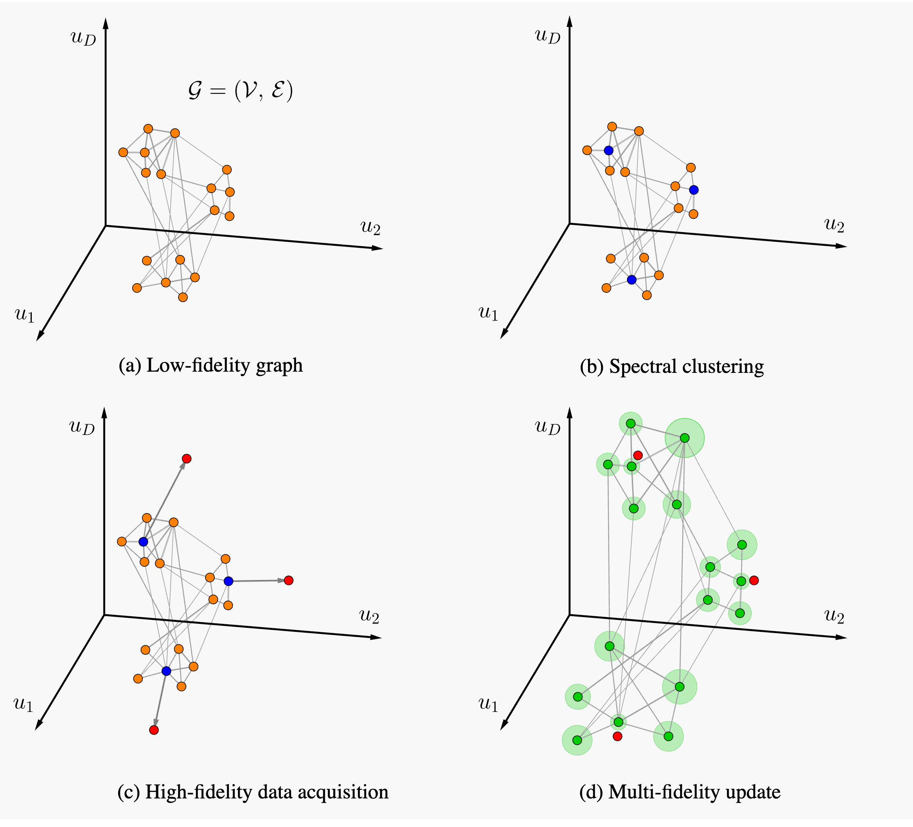
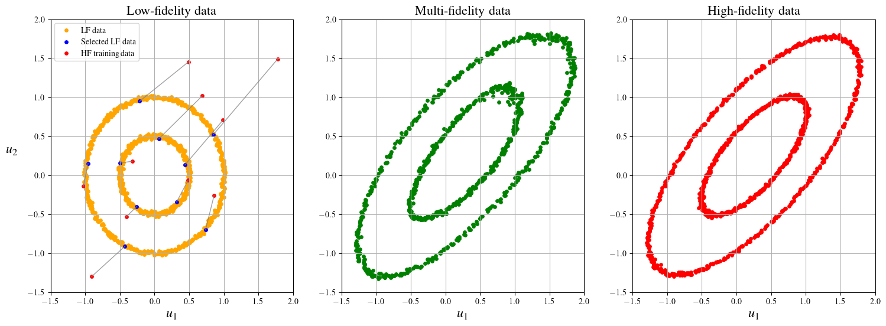

# Graph Laplacian-based Bayesian Multi-fidelity Modeling

## Overview

A Python package for graph laplacian-based multi-fidelity modeling.



## Features

- Perform multi-fidelity modeling using Bayesian specmf method
- Simple `Graph` class to store graphs and their representations
- Method computations happen in a dedicated `MultiFidelityModel` class  
- Utilities for preprocessing and visualize data for multi-fidelity modeling
- Includes several experiments for testing the models

## Installation

### Using `pip`

You can install the package and its dependencies by running:

```bash
cd local/path/spectral-multifidelity
pip install .
```

For development mode:

```bash
cd local/path/spectral-multifidelity
pip install -e .
```

### Dependencies

The project requires the following libraries:

- `numpy`
- `scipy`
- `scikit-learn`
- `scikit-optimize`
- `umap-learn`
- `matplotlib`

The code has been tested with Python 3.12.

## Usage

### Importing the package

Once installed, you can import the main module and start using the classes and functions provided by the package.

```python
from specmf import MultiFidelityModel, Graph
```

### Example Usage

For end-to-end examples on how to use, please check the experiment notebooks.

The main module of the package is `models`. Below are examples demonstrating how to use these modules.

### 1. Using the `Graph` class from `models.py`

The `Graph` class inherhits from `GraphCore` class, which computes graph-based representations, such as the adjacency matrix and the normalized graph Laplacian. 
Here is an example of how to initialize the class and compute an adjacency matrix.

```python
import numpy as np
from specmf.models import Graph


# Create some sample data
data = np.random.rand(10, 3)  # 10 samples with 3 features each

# Initialize GraphCore with default parameters
graph = Graph(data=data)

# Compute adjacency matrix
adjacency = graph.adjacency

# Compute normalized graph Laplacian
graph_laplacian = graph.graph_laplacian

print(f"{adjacency.shape=}")
print(f"{graph_laplacian.shape=}")
```


### 2. Using the `MultiFidelityModel` class from `models.py`

The `MultiFidelityModel` class is designed to perform multi-fidelity modeling. 
It allows you to transform all nodes of a graph based on a few more accurate nodes data.


#### 2.1 Generate some synthetic data

First, let's generate some data to use in this illustrative example:

```python
import numpy as np
from specmf.models import Graph, MultiFidelityModel
from specmf.plot import *


## Generate random data
np.random.seed(42)
n_lf = 100
n_hf = 15

# Low-fidelity data - 3 clusters
lf_data = np.vstack((
    0.15 * np.random.randn(n_lf, 2) + [0.5, 1],
    0.15 * np.random.randn(n_lf, 2) + [-1, 1.25],
    0.20 * np.random.randn(n_lf, 2) + [-0.5, -0.75],
))

# High-fidelity undelrying (unknown) data
hf_data = np.vstack((
    lf_data[:n_lf, :] + [1.5, 1.75],
    lf_data[n_lf:2 * n_lf, :] + [-2, 1.75],
    lf_data[2 * n_lf:, :] + [0.25, -2],
))

# Assume we have high-fidelity data at these indices
hf_train_inds = np.random.choice(3 * n_lf, n_hf)
hf_data_train = hf_data[hf_train_inds, :]
```
#### 2.2 Use of `Graph` and `MultiFidelityModel`

Let's now use a model to transform the nodes:

```python
## Multi fidelity model
# Create the graph
graph_config = {
    'metric': 'euclidean',
    'dist_space': 'ambient',
    'method': 'full',
    'corr_scale': None,
    'k_adj': 7,
    'p': 0.5,
    'q': 0.5,
}
graph_lf = Graph(
    data=lf_data,
    **graph_config,
)

# Initialize the model
model_config = {
    'sigma': 0.01,
    'kappa': 10,
    'method': 'full',
}
model = MultiFidelityModel(**model_config)

# Transform the data
mf_data, mf_covar_mat, mf_var = model.transform(
    graph_lf,
    hf_data_train,
    hf_train_inds,
)
model.summary()
```
#### 2.3 Visualize the results

We can now plot the low-, multi-, and high-fidleity data:

```python
## Plot results
fig, axs = plt.subplots(1, 3, figsize=(18, 6))

# Low-fidelity data
axs[0].set_title("Low-fidelity data", fontsize=16)
axs[0].scatter(lf_data[:, 0], lf_data[:, 1], color='orange', s=15, label='LF data')
axs[0].scatter(lf_data[hf_train_inds, 0], lf_data[hf_train_inds, 1], s=15, color='blue', label='Selected LF data')
axs[0].scatter(hf_data_train[:, 0], hf_data_train[:, 1], color='red', s=15, label='HF training data')
for i in range(len(hf_train_inds)):
    axs[0].plot(
        [lf_data[hf_train_inds[i], 0], hf_data_train[i, 0]],
        [lf_data[hf_train_inds[i], 1], hf_data_train[i, 1]],
        color='grey',
        linewidth=1.,
        alpha=0.75,
    )
axs[0].legend()


# Multi-fidelity data
axs[1].set_title("Multi-fidelity data", fontsize=16)
axs[1].scatter(mf_data[:, 0], mf_data[:, 1], s=15, color='green')

# High-fidelity data
axs[2].set_title("High-fidelity data", fontsize=16)
axs[2].scatter(hf_data[:, 0], hf_data[:, 1], s=15, color='red')

for ax in axs:
    ax.set_xlabel(r"$u_1$", fontsize=16)
    ax.grid(True)
    ax.set_xlim(-3.75, 2.5)
    ax.set_ylim(-3.5, 3.5)
axs[0].set_ylabel(r"$u_2$", fontsize=16, rotation=0, labelpad=20)
```


### 3. Spectral clustering

The `MultiFidelityModel` class has also built-in functionalities to perform spectral clustering of graphs. 
Here's an example of using the `cluster()` method:

```python
# Perform clustering on the graph to find the high-fidelity indices
inds_centroids, labels = model.cluster(graph_lf, n=n_hf)

fig, ax = plt.subplots(1, 1, figsize=(5, 5))
ax.set_title("Spectral clustering of low-fidleity data", fontsize=16)
ax.scatter(lf_data[:, 0], lf_data[:, 1], s=25, c=labels, cmap='tab20')
ax.scatter(lf_data[inds_centroids, 0], lf_data[inds_centroids, 1], color='red', s=40, label='Centroids')

ax.legend()
ax.set_xlabel(r"$u_1$", fontsize=16)
ax.set_ylabel(r"$u_2$", fontsize=16, rotation=0, labelpad=20)
ax.grid(True)
```


#### 3.1 High-fidelity data aquisition policy

Clustering can be used to select the nodes where to acquire high-fidelity data.
Let's use the model again with a new set of training high-fidelity data:

```python
# Aquire high-fidelity data at the centroids location
hf_data_train = hf_data[inds_centroids, :]

# Transform the data
mf_data, mf_covar_mat, mf_var = model.transform(
    graph_lf,
    hf_data_train,
    inds_centroids,
)
model.summary()
```

The results with a high-fidelity data acquisition strategy based on clustering:

```python
## Plot results
fig, axs = plt.subplots(1, 3, figsize=(18, 6))

# Low-fidelity data
axs[0].set_title("Low-fidelity data", fontsize=16)
axs[0].scatter(lf_data[:, 0], lf_data[:, 1], color='orange', s=15, label='LF data')
axs[0].scatter(lf_data[inds_centroids, 0], lf_data[inds_centroids, 1], s=15, color='blue', label='Selected LF data')
axs[0].scatter(hf_data_train[:, 0], hf_data_train[:, 1], color='red', s=15, label='HF training data')
for i in range(len(inds_centroids)):
    axs[0].plot(
        [lf_data[inds_centroids[i], 0], hf_data_train[i, 0]],
        [lf_data[inds_centroids[i], 1], hf_data_train[i, 1]],
        color='grey',
        linewidth=1.,
        alpha=0.75,
    )
axs[0].legend()


# Multi-fidelity data
axs[1].set_title("Multi-fidelity data", fontsize=16)
axs[1].scatter(mf_data[:, 0], mf_data[:, 1], s=15, color='green')

# High-fidelity data
axs[2].set_title("High-fidelity data", fontsize=16)
axs[2].scatter(hf_data[:, 0], hf_data[:, 1], s=15, color='red')

for ax in axs:
    ax.set_xlabel(r"$u_1$", fontsize=16)
    ax.grid(True)
    ax.set_xlim(-3.75, 2.5)
    ax.set_ylim(-3.5, 3.5)
axs[0].set_ylabel(r"$u_2$", fontsize=16, rotation=0, labelpad=20)
```



### 4. Uncertainty Quantification

The model provides also the variance of each multi-fidelity esimate, which can be interpreted as an uncertainty measure.
We can visualize it for this simple 2-d example by coloring each data point based on the value of variance:

```python
# Plot the variance of multi-fidelity esimates
fig, ax = plt.subplots(1, 1, figsize=(7, 6))
scatter = ax.scatter(mf_data[:, 0], mf_data[:, 1], c=mf_var, s=20)
ax.scatter(mf_data[inds_centroids, 0], mf_data[inds_centroids, 1], c='red', s=25, label='HF training data')
ax.set_title("Variance of multi-fidelity estimates", fontsize=16)
ax.set_xlabel(r"$u_1$", fontsize=16)
ax.set_ylabel(r"$u_2$", fontsize=16, rotation=0, labelpad=20)
fig.colorbar(scatter, ax=ax,)
ax.legend(loc="lower left", fontsize=12)
ax.grid(True)
```


## Project Structure

```bash
spectral-multifidelity/
│
├── data/                  # Contains datasets for experiments
├── specmf/                # Main code
│   ├── __init__.py        # Initialization file
│   ├── models.py          # Contains model and graph classes
│   ├── preprocess.py      # Data preprocessing utilities
│   ├── graph_core.py      # Core graph class
│   ├── utils.py           # Utility functions
├── notebooks/             # Notebooks with experiments
├── tests/                 # Unit tests
├── setup.py               # Setup file for packaging
├── requirements.txt       # List of dependencies
└── README.md              # Project documentation (this file)
```

## Contact

For any questions or issues, please reach out at orazio.pinti@gmail.com 

## Reference

Source code of the paper: 

**Graph Laplacian-based Bayesian Multi-fidelity Modelinge**  
O. Pinti, J. M. Budd, F. Hoffmann, A. A. Oberai.
[arXiv:2409.08211](https://arxiv.org/abs/2409.08211)
