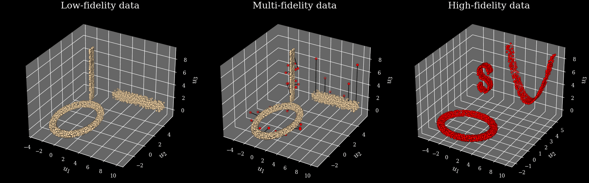
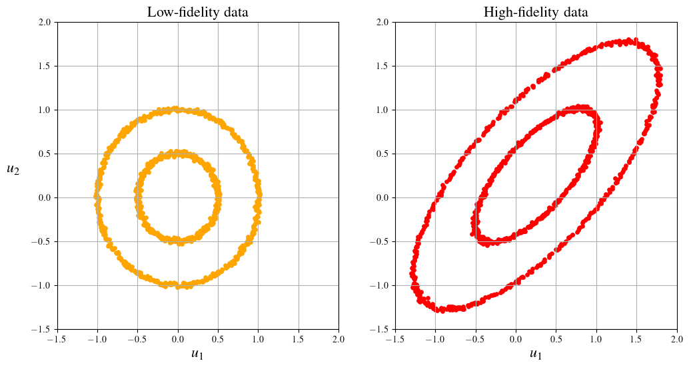
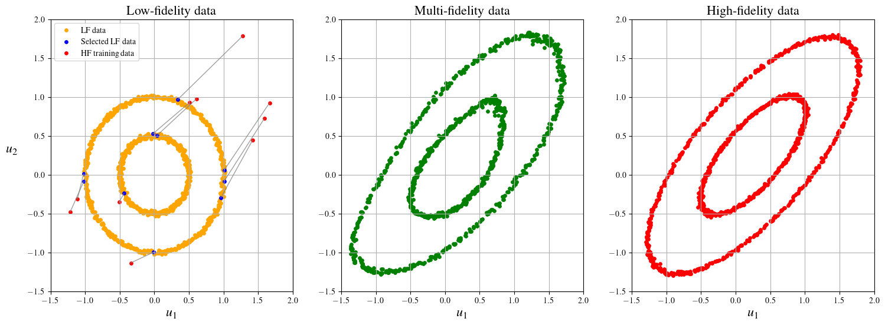
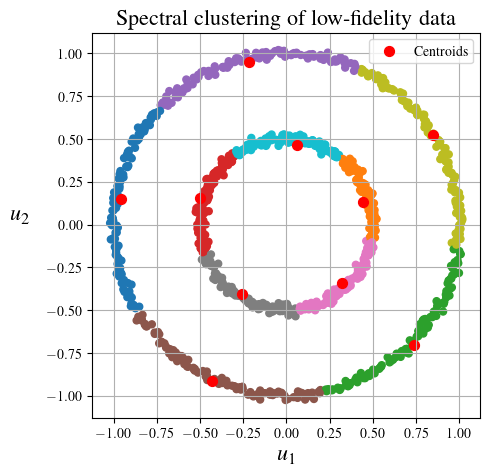
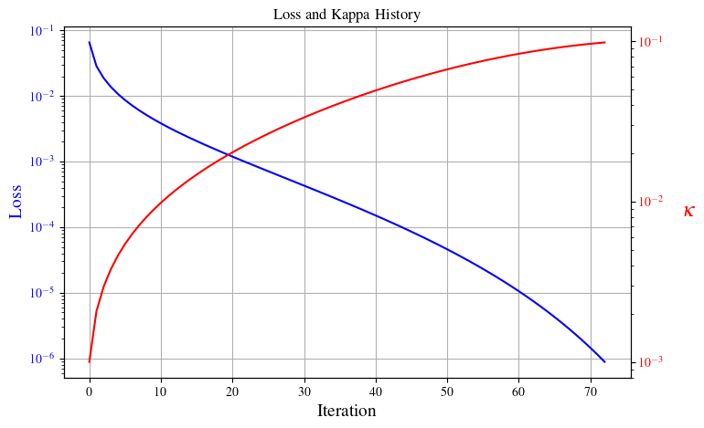
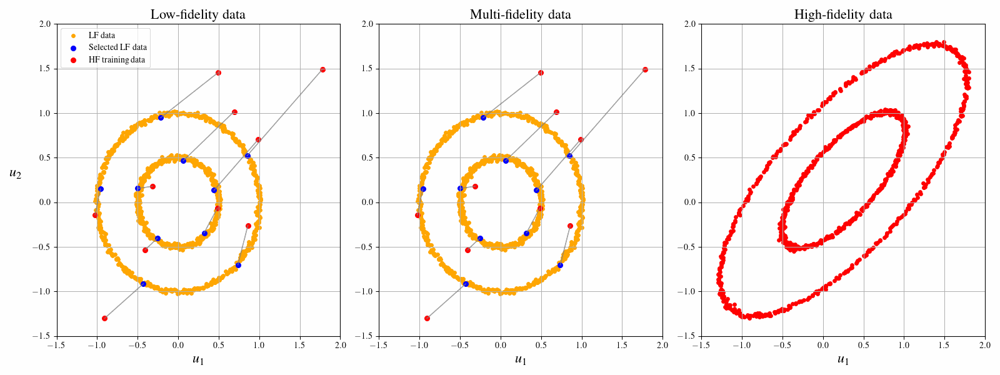
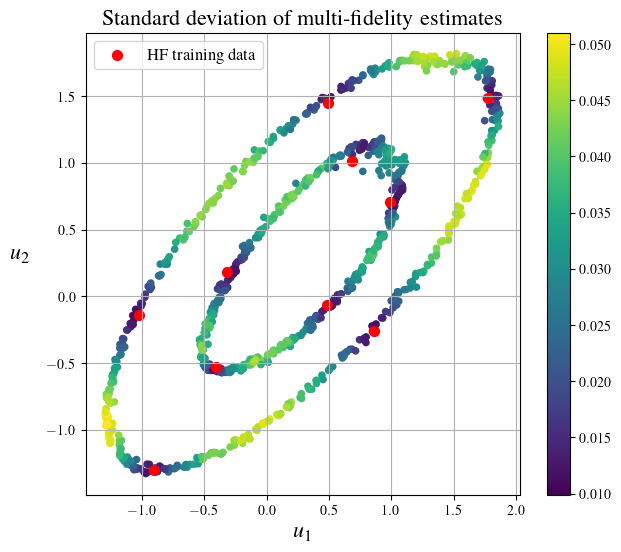

# Graph Laplacian-based Bayesian Multi-fidelity Modeling

[](https://www.python.org/downloads/)
[](LICENSE.txt)
[](https://arxiv.org/abs/2409.08211)

A Python package for graph Laplacian-based multi-fidelity modeling.

<p align="center">
  
</p>


---

## Overview

This package provides tools for **multi-fidelity modeling** that combine inexpensive low-fidelity data with a small number of high-fidelity observations. By leveraging graph Laplacian spectral decomposition and Bayesian inference, the method propagates high-fidelity information across the entire dataset, producing accurate estimates with quantified uncertainty.


## Installation

### Standard Installation

```bash
cd /path/to/spectral-multifidelity
pip install .
```

### Development Mode

```bash
pip install -e .
```

### Requirements

- **Python:** 3.12+
- **Dependencies:**
  - `numpy >= 1.26.0`
  - `scipy >= 1.11.3`
  - `scikit-learn >= 1.5.1`
  - `matplotlib >= 3.8.0`
  - `umap-learn >= 0.5.6`
  - `pyyaml >= 5.1`

All dependencies are automatically installed via `pip`.

---

## Quick Start

### Basic Example

Here's a minimal example to get started:

```python
import numpy as np
from specmf import Graph, MultiFidelityModel

# Your low-fidelity and high-fidelity data
lf_data = np.random.rand(1000, 3)  # 1000 samples, 3D
hf_data = np.random.rand(1000, 3)  # Corresponding HF data

# Select a small subset for HF training
hf_indices = np.random.choice(1000, 10, replace=False)
hf_train = hf_data[hf_indices]

# Build graph and create model
graph = Graph(data=lf_data)
model = MultiFidelityModel()

# Transform LF data using HF observations
mf_data, mf_covar, mf_std = model.transform(graph, hf_train, hf_indices)
```

For complete examples, see the [notebooks](notebooks/) directory.

---

## Usage Guide

### 1. Graph Construction

The `Graph` class provides graph-based representations using spectral methods.

```python
import numpy as np
from specmf import Graph

# Create sample data
data = np.random.rand(100, 3)

# Initialize graph with custom parameters
graph = Graph(
    data=data,
    metric='euclidean', # Metric to measure sample similarity
    method='k-nn'       # Options are 'full', for fully connected, or 'k-nn'
    k_nn=20,            # Number of nearest neighbors if method='k-nn'
)

# Access graph properties
adjacency = graph.adjacency              # Adjacency matrix
laplacian = graph.graph_laplacian        # Normalized Laplacian
eigvals, eigvecs = graph.laplacian_eig() # Spectral decomposition
```


### 2. Multi-Fidelity Modeling

The `MultiFidelityModel` class fuses low- and high-fidelity data to produce multi-fidelity estimates.

#### 2.1 Synthetic Data Generation

Generate example data:

```python
from data.synthetic import generate_circles_2d

# Generate 2D synthetic data with different noise levels
lf_data, hf_data = generate_circles_2d(
    n_samples=1000,
    noise_scale_lf=0.015,  # Low-fidelity noise
    noise_scale_hf=0.01,   # High-fidelity noise
    random_state=42
)
```

<p align="center">
  
</p>

#### 2.2 Model Training and Transformation

Transform low-fidelity data using a small subset of high-fidelity observations:

```python
from specmf import Graph, MultiFidelityModel

# Select 10 random points for HF training
np.random.seed(42)
n_hf = 10
hf_indices = np.random.choice(len(lf_data), n_hf, replace=False)
hf_train = hf_data[hf_indices]

# Build graph from LF data
graph = Graph(data=lf_data, k_adj=11, method='full')

# Initialize model with HF noise level
model = MultiFidelityModel(sigma=0.01)

# Transform to multi-fidelity estimates
mf_data, mf_covar, mf_std = model.transform(graph, hf_train, hf_indices)

# Display model configuration
model.summary()
```

**Output:**
```
=============================================
Model Configuration:
=============================================
sigma              : 0.01
beta               : 2
kappa              : 0.001
omega              : 608.50
method             : full
tau                : 0.00128
=============================================
```

#### 2.3 Visualization

Compare low-fidelity, multi-fidelity, and high-fidelity results:

```python
import matplotlib.pyplot as plt

fig, axes = plt.subplots(1, 3, figsize=(18, 6))

# Low-fidelity with training points
axes[0].scatter(lf_data[:, 0], lf_data[:, 1], c='orange', s=15, label='LF data')
axes[0].scatter(hf_train[:, 0], hf_train[:, 1], c='red', s=30, label='HF training')
axes[0].set_title('Low-Fidelity Data')

# Multi-fidelity estimates
axes[1].scatter(mf_data[:, 0], mf_data[:, 1], c='green', s=15)
axes[1].set_title('Multi-Fidelity Data')

# True high-fidelity
axes[2].scatter(hf_data[:, 0], hf_data[:, 1], c='red', s=15)
axes[2].set_title('High-Fidelity Data')

plt.tight_layout()
```

<p align="center">
  
</p>


### 3. High-fidelity Data Acquisition Strategy

Rather than randomly selecting high-fidelity training points, use **spectral clustering** to choose representative samples that cover the data manifold uniformly.

#### 3.1 Spectral Clustering

The `Graph` class provides spectral clustering based on the graph Laplacian eigenfunctions:


```python
# Cluster the graph into n_hf clusters
centroid_indices, cluster_labels = graph.cluster(n=n_hf)

# Visualize clustering
plt.figure(figsize=(6, 6))
plt.scatter(lf_data[:, 0], lf_data[:, 1], c=cluster_labels, s=25, cmap='tab10')
plt.scatter(lf_data[centroid_indices, 0], lf_data[centroid_indices, 1], 
            c='red', s=100, marker='*', label='Centroids', edgecolor='black')
plt.legend()
plt.title('Spectral Clustering')
```

<p align="center">
  
</p>

#### 3.2 Model Fitting

Use `fit_transform()` to tune the regularization parameter `kappa` and compute multi-fidelity estimates:

```python
# Acquire HF data at cluster centroids
hf_train = hf_data[centroid_indices]

# Fit model with adaptive kappa tuning
model = MultiFidelityModel(sigma=0.01)
mf_data, mf_covar, mf_std, loss_hist, kappa_hist = model.fit_transform(
    graph,
    hf_train,
    centroid_indices,
    r=3.0,              # Target uncertainty ratio (MF/HF)
    verbose=True
)

# Visualize optimization progress
from specmf.plot import plot_loss_and_kappa
plot_loss_and_kappa(loss_hist, kappa_hist)
```

<p align="center">
  
</p>

#### 3.3 Results

The clustering-based strategy produces significantly better multi-fidelity estimates:

<p align="center">
  
</p>

The multi-fidelity data (center, green) closely matches the true high-fidelity data (right, red), despite using only 10 training points selected as cluster centroids.

### 4. Uncertainty Quantification

Every multi-fidelity estimate includes an uncertainty metric via its standard deviation. We note how the model's uncertainty increases as we move further away from the training data, and approaches the high-fidelity uncertainty nearby them.

```python
# Plot uncertainty distribution
plt.figure(figsize=(7, 6))
scatter = plt.scatter(mf_data[:, 0], mf_data[:, 1], c=mf_std, s=20, cmap='viridis')
plt.scatter(mf_data[centroid_indices, 0], mf_data[centroid_indices, 1], 
            c='red', s=50, marker='*', label='HF training', edgecolor='black')
plt.colorbar(scatter, label='Standard Deviation')
plt.title('Multi-Fidelity Uncertainty')
plt.legend()
```

<p align="center">
  
</p>

---

## Project Structure

```
spectral-multifidelity/
├── specmf/                    # Core package
│   ├── models.py              # Graph and MultiFidelityModel classes
│   ├── graph_core.py          # Base graph operations
│   ├── preprocess.py          # Data preprocessing utilities
│   ├── plot.py                # Visualization tools
│   ├── utils.py               # Helper functions
│   └── validation.py          # Model validation tools
├── data/                      # Datasets for experiments
│   ├── synthetic/             # Synthetic data utils
│   └── [domain-specific]/     # Real datasets
├── notebooks/                 # Jupyter notebook examples
│   ├── experiments/           # Application examples
│   └── *.ipynb                # Tutorial notebooks
├── tests/                     # Unit tests
├── figures/                   # Documentation figures
└── requirements.txt           # Package dependencies
```

---

## Paper

**ArXiv:** [arXiv:2409.08211](https://arxiv.org/abs/2409.08211)

**Citation:**
```bibtex
@article{
  PINTI2025117647,
  author = {Orazio Pinti and Jeremy M. Budd and Franca Hoffmann and Assad A. Oberai},
  doi = {https://doi.org/10.1016/j.cma.2024.117647},
  issn = {0045-7825},
  journal = {Computer Methods in Applied Mechanics and Engineering},
  keywords = {Multi-fidelity modeling, Bayesian inference, Uncertainty quantification, Semi-supervised learning, Graph-based learning},
  pages = {117647},
  title = {Graph Laplacian-based Bayesian multi-fidelity modeling},
  url = {https://www.sciencedirect.com/science/article/pii/S0045782524009010},
  volume = {435},
  year = {2025},
  Bdsk-Url-1 = {https://www.sciencedirect.com/science/article/pii/S0045782524009010},
  Bdsk-Url-2 = {https://doi.org/10.1016/j.cma.2024.117647}
}
```

---

## License

This project is licensed under the MIT License. See the [LICENSE.txt](LICENSE.txt) file for details.

## Contact

**Orazio Pinti**  
📧 orazio.pinti@gmail.com
